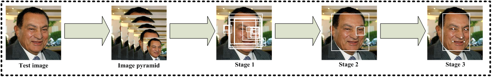

# MTCNN
[](LICENSE) [](https://php.net/)

# PHP-MTCNN - Implementation of the MTCNN face detector for PHP



## Requirements
- PHP 7.4 / 8.0
- PHP extension [php-opencv](https://github.com/php-opencv/php-opencv)

## Usage

```php
use \Junker\MTCNN\MTCNN;

$mtcnn = new MTCNN();

$factor = 0.709;
$threshold = [0.7, 0.6, 0.6];
$minSize = 12;

$image = \CV\imread($image_path, 1);
$faces = $mtcnn->detect($image, $minSize, $threshold, $factor);

foreach ($faces as $face)
{
	$x = (int) $face->bbox->xmin;
	$y = (int) $face->bbox->ymin;
	$x2 = (int) $face->bbox->xmax;
	$y2 = (int) $face->bbox->ymax;
	$score = $face->bbox->score;

	\CV\rectangle($image, $x, $y, $x2, $y2, new \CV\Scalar(255, 0, 0), 2);

	print_r($face);
}

\CV\imshow("image", $image);
\CV\waitKey(0);
```

Based on https://github.com/imistyrain/MTCNN
